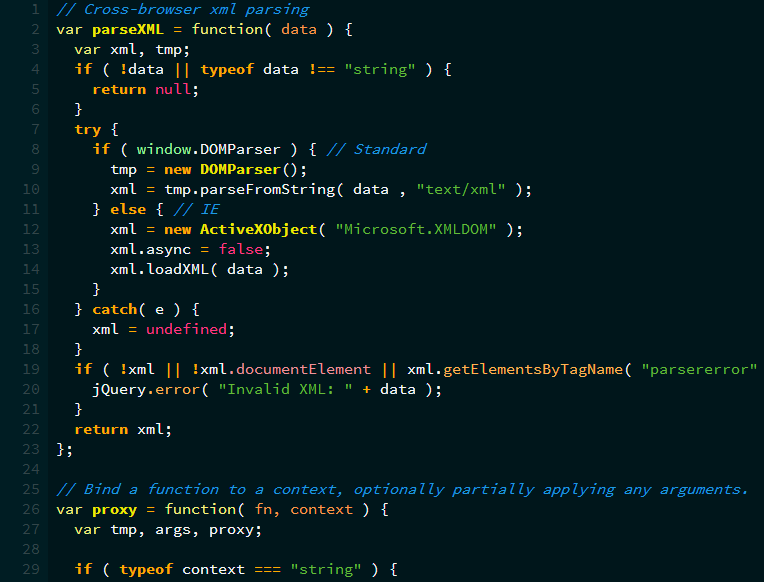

PlasticCodeWrap
==========================

--------------------------

Ryan Todd's 'Plastic Code Wrap'                          
ported by Joe DF                              
(http://www.plasticstare.com/)   

--> [Contact Me](mailto:joedf@users.sourceforge.net) for Requests, Comments, Contributions, etc.

Now Available For:                   
- [AHK Studio](AHK_Studio)  
- [Aptana](Aptana)   
- [Dev-C++](Dev-C++)     
- [Eclipse](Eclipse)      
- [EverEdit](EverEdit)
- [FASMW](FASMW)    
- [GVIM](GVIM)     
- [jEdit](jEdit)     
- [Kate](Kate_KWrite)     
- [KWrite](Kate_KWrite)     
- [Notepad++](Notepad++)    
- [Programmer's Notepad](Programmers_Notepad)     
- [SciTE4AutoHotkey](SciTE4AutoHotkey)       
- [SharpDevelop](Visual_Studio_and_SharpDevelop)     
- [Sublime Text](SublimeText_and_Textmate)     
- [Textmate](SublimeText_and_Textmate)      
- [Visual Studio](Visual_Studio_and_SharpDevelop)     
     
Get them all in a zip here:       
<<<<<<< HEAD
([Master.zip](https://github.com/joedf/PlasticCodeWrap/archive/master.zip))
=======
([Master.zip](https://github.com/joedf/PlasticCodeWrap/archive/master.zip))
>>>>>>> b8bfd7d112f6ee0eed91632f5956c1c7569bc89a
