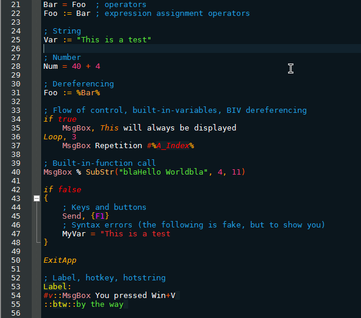
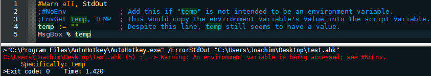

PlasticCodeWrap
==========================

--------------------------

Ryan Todd's, 'Plastic Code Wrap.'                                                   
ported to SciTE by Joe DF                              
(http://www.plasticstare.com/)   

This derivative is by Joe DF (http://joedf.co.nr)    
Default SciTE4Ahk theme (by [fincs](http://github.com/fincs/ "fincs")) was used as template

Version: 1.2                                                                         
Date: July 10th, 2013

--> Contact Me for Requests, Comments, Contributions, etc.

Now Available For:                   
-[AHK Studio](AHK_Studio)  
-[Dev-C++](Dev-C++)     
-[Eclipse](Eclipse)      
-[FASMW](FASMW)    
-[GVIM](GVIM)     
-[jEdit](jEdit)     
-[Kate](Kate_KWrite)     
-[KWrite](Kate_KWrite)     
-[Notepad++](Notepad++)    
-[Programmer's Notepad](Programmers_Notepad)     
-[SciTE4AutoHotkey](SciTE4AutoHotkey)       
-[SharpDevelop](Visual_Studio_and_SharpDevelop)     
-[Sublime Text](SublimeText_and_Textmate)     
-[Textmate](SublimeText_and_Textmate)      
-[Visual Studio](Visual_Studio_and_SharpDevelop)     
     
Get them all in a zip here:       
([Master.zip](https://github.com/joedf/PlasticCodeWrap4_SciTE4Ahk/archive/master.zip))